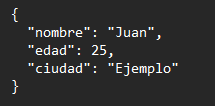
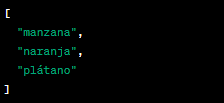
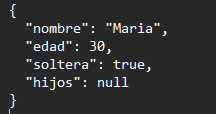
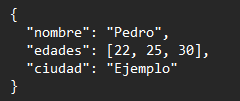
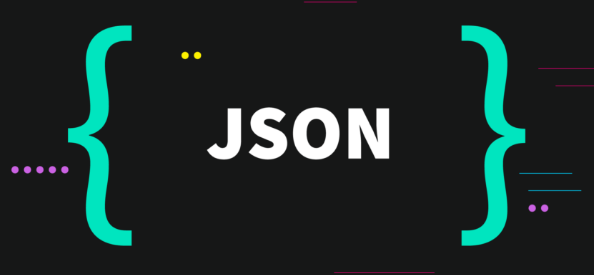

### Lenguaje De Marcas
### Santiago Bernal Gomez
### IES SANT VICENT FERRER
### 1RO DAM
### 16/01/24
---------------------------
### **Índice**
1. ¿Qué es JSON?
2. Sintaxis y Ejemplos de JSON
3. Los usos de JSON
4. Como Funciona JSON
5. Cuales son sus caracteristicas
6. Bibliografía
---------------------------

# **JSON** 
### **¿Que es JSON?**
JSON (JavaScript Object Notation) es un lenguaje ligero, basado en texto, que se utiliza para almacenar e intercambiar datos 
que resulta muy fácil de leer ademas de escribir para los programadores es sencillo de interpretar y crear para las máquinas. Se basa en el lenguaje de programación JavaScript,
pero es utilizado por una gran variedad de aplicaciones de software, lo que lo convierte en uno de los formatos de almacenamiento de datos más versátiles de la actualidad.

### **Sintaxis de YAML**
La sintaxis de JSON es bastante sencilla y está diseñada para ser fácilmente legible por humanos. Aquí hay una descripción básica de la sintaxis:

**Objetos JSON:**
- Un objeto JSON se representa entre llaves {}.
- Dentro de las llaves, los datos se organizan en pares clave-valor.
- La sintaxis general es {"clave": "valor"}.
  
**Ejemplo:**

  

**Arrays JSON:**

- Un array JSON se representa entre corchetes [].
- Los elementos del array pueden ser valores, objetos JSON, o incluso otros arrays.
- Los elementos del array se separan por comas.
  
**Ejemplo:**
  
 

 **Valores JSON:**
- Los valores pueden ser cadenas de texto (siempre entre comillas dobles), números, objetos JSON, arrays, booleanos (true o false), o null.
  
**Ejemplo:**

   

   **Uso de Comas:**

- En objetos y arrays, los elementos se separan por comas ,.

**Ejemplo:**

 

### **Los usos de JSON**
JSON se utiliza a menudo como alternativa a otras bases de datos y formatos de almacenamiento de datos, como XML o CSV. Es especialmente popular en aplicaciones web, donde se puede convertir fácilmente desde y hacia otros formatos como HTML y JavaScript. Además, como la sintaxis de JSON es sencilla y fácil de entender, muchos desarrolladores lo encuentran mucho más fácil de usar que otros formatos de datos.

### **¿Cómo funciona?**
Una de las características más significativas de JSON, al ser un formato independiente de los lenguajes de programación, es que los servicios que comparten información por este método no necesitan hablar el mismo idioma. Es decir que el emisor y el receptor pueden ser totalmente distintos, por ejemplo, Java y Python. Esto es así porque cada uno tiene su propia librería de codificación y decodificación para cadenas en este formato.

### **¿Cuáles son sus características?**

Según el campus Academy by Numen, las características de JSON son:

- JSON es solo un formato de datos.
- Requiere usar comillas dobles para las cadenas y los nombres de propiedades. Las comillas simples no son válidas.
- Una coma o dos puntos mal ubicados pueden producir que un archivo JSON no funcione.
- Puede tomar la forma de cualquier tipo de datos que sea válido para ser incluido en un JSON, no solo arreglos u objetos. Así, por ejemplo, una cadena o un número único podrían ser objetos JSON válidos.
- A diferencia del código JavaScript, en el que las propiedades del objeto pueden no estar entre comillas, en JSON solo las cadenas entre comillas pueden ser utilizadas como propiedades.

  

# Bibliografía

[1]: ARIMETRICS. *¿Qué es JSON?*. [URL del sitio web: ] (https://www.arimetrics.com/glosario-digital/json)

[2]: NEXT_U. *¿QUE ES JSON?*. [URL del sitio web: ] (https://www.nextu.com/blog/que-es-json-por-que-es-importante-conocerlo-rc22/)
