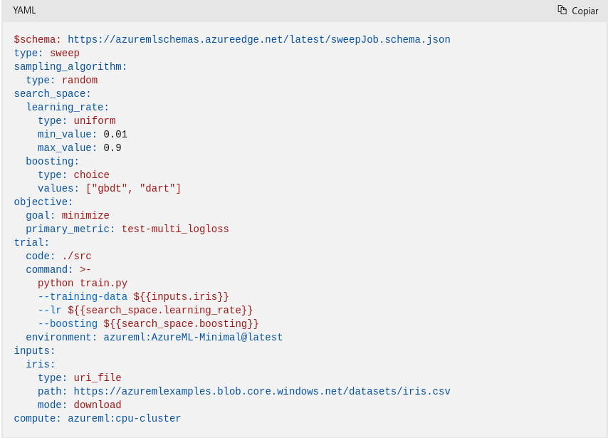

# **YAML** 
### **¿Que es YAML?**
Es un lenguaje de serialización de datos ampliamente utilizado en el diseño de archivos de configuración. A diferencia de algunos lenguajes de marcado, *YAML* se destaca por su enfoque en la representación de datos en lugar de documentos. 
Su popularidad se debe a su diseño que lo hace fácil de leer y comprender, lo cual lo convierte en una elección popular para la configuración en diversas aplicaciones.
Este lenguaje de programación se distingue por su flexibilidad y accesibilidad, lo que permite su integración sin complicaciones con otros lenguajes de programación. 
*YAML* facilita la tarea de definir estructuras de datos de manera legible para los humanos, lo que lo convierte en una herramienta valiosa en entornos donde la claridad y la comprensión rápida son fundamentales. 
*YAML* ofrece una solución eficaz y versátil para la representación de datos, destacando por su simplicidad y utilidad en la configuración y comunicación de información entre sistemas.

### **Sintaxis de YAML**
YAML, con extensiones de archivo *.yml* o *.yaml*, emplea reglas de sintaxis específicas que hacen que sea fácil de leer y entender. Su sintaxis se inspira en varios lenguajes de programación, como *Perl*, *C*, *XML*, *HTML*, y comparte similitudes con JSON. La extensión de YAML hacia JSON permite la compatibilidad entre ambos formatos.
La estructura de YAML prescinde de símbolos habituales, como llaves y corchetes, favoreciendo la simplicidad y legibilidad. Utiliza la sangría al estilo Python para definir la estructura jerárquica, indicando la inclusión de un elemento dentro de otro. Evita el uso de caracteres de tabulación para mantener la portabilidad en todos los sistemas, empleando espacios en blanco en su lugar.
Los comentarios, marcados por el símbolo numeral (#), son práctica recomendada para describir la intención del código. YAML no admite comentarios de varias líneas.
Los tres guiones (---) señalan el inicio de un documento, mientras que tres puntos (...) lo terminan.
Un ejemplo básico de YAML muestra una lista de compras, donde la estructura se organiza en mapas y listas. Los mapas asocian pares de clave-valor, y las listas incluyen valores en un orden específico, indicados por el guion (-) y la sangría.
Es crucial resolver los mapas para cerrarlos y, si es necesario, crear nuevos aumentando la sangría o resolviendo el mapa anterior.
Además, YAML incluye valores sencillos (escalares) que pueden ser cadenas, números, fechas o booleanos.
Para garantizar la validez del archivo YAML, es recomendable utilizar linters, como el comando yamllint, que verifica la sintaxis antes de enviar el archivo a una aplicación. En resumen, YAML destaca por su sintaxis simple, flexibilidad y capacidad para representar datos de manera legible y comprensible.

### **Ejemplo de sintaxis de YAML**
Este es un ejemplo de un archivo YAML 
Si este archivo se traduce a Python con la biblioteca PyYAML, se generará la estructura de datos siguiente:

# Bibliografía

[1]: RED HAT. *¿Qué es YAML?*. [URL del sitio web: ] (https://www.redhat.com/es/topics/automation/what-is-yaml)https://www.redhat.com/es/topics/automation/what-is-yaml)

